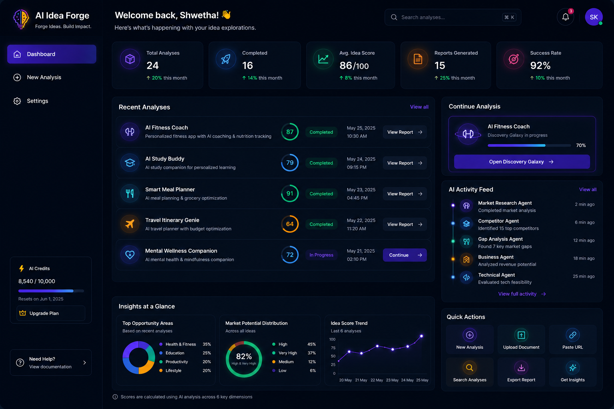
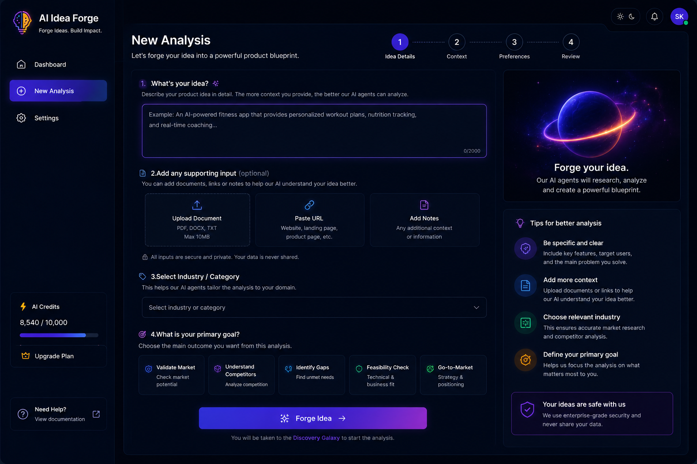

> **AI-powered validation and research platform for business ideas and product concepts**

AI Idea Forge helps users research and evaluate a business idea or product concept before moving forward with it. The platform combines **six specialized AI agents** into an automated workflow that analyzes the idea from multiple perspectives and presents the results through a visual interface and structured reports.

🔗 **Live Application:** https://discovery-agent-lab.lovable.app

---

## Overview

Evaluating a new idea often requires research across several areas:

- Market demand
- Competitors
- Customer needs and market gaps
- Business and technical feasibility
- Risks and challenges
- Strategic recommendations

AI Idea Forge brings these activities into one workflow.

A user submits an idea, the request is processed through **n8n**, six specialized AI agents perform their analysis, results are stored in **Supabase**, and the completed analysis is presented through the **Discovery Galaxy**, dashboard, and reports.

---

## Key Features

### 🤖 Six Specialized AI Agents

| Agent | Purpose |
|---|---|
| **Market Research** | Evaluates market demand, trends, customer segments and market factors |
| **Competitor Analysis** | Identifies relevant direct and indirect competitors |
| **Gap Analysis** | Identifies unmet needs, market gaps and opportunities |
| **Feasibility Analysis** | Evaluates business and technical feasibility |
| **Risk & Challenge** | Identifies potential business and technical risks |
| **Recommendation Engine** | Generates strategic recommendations and next steps |

### 🌌 Discovery Galaxy

A visual multi-agent interface that allows users to see:

- Agent execution status
- Analysis progress
- Completed and running agents
- Confidence scores
- Overall analysis status

### 📊 Dashboard

Provides an overview of analysis activity, including:

- Analysis history
- Confidence information
- Confidence trends
- Re-analysis count
- Reports
- User-specific information

### 🔄 Re-analysis

Users can run an analysis again when they want to reassess an idea.

Each retry/re-analysis increments the stored re-analysis count and updates the analysis results.

### 👤 User & Admin Roles

The application supports two roles:

- **User** — access their own analyses
- **Admin** — can view all analysis records

### 📄 Reports

Completed analysis results can be reviewed through the application and generated as structured reports.

---

## How It Works

```text
                    USER
                      │
                      ▼
            Submit Idea / Product
                      │
                      ▼
             Frontend Validation
                      │
                      ▼
                  Supabase
                      │
                      ▼
               n8n Orchestration
                      │
          ┌───────────┼───────────┐
          │           │           │
          ▼           ▼           ▼
       Market     Competitor     Gap
      Research     Analysis    Analysis
          │           │           │
          ├───────────┼───────────┤
          │           │           │
          ▼           ▼           ▼
     Feasibility     Risk     Recommendation
       Analysis    & Challenge   Engine
          │           │           │
          └───────────┼───────────┘
                      │
                      ▼
              Results Stored
                      │
                      ▼
            Overall Confidence
                      │
                      ▼
              Analysis Complete
                      │
             ┌────────┴────────┐
             ▼                 ▼
       Discovery Galaxy     Dashboard
             │                 │
             └────────┬────────┘
                      ▼
                   Report
```

---

## Technology Stack

| Technology | Role |
|---|---|
| **Lovable** | Frontend and user interface |
| **n8n** | Workflow automation and AI orchestration |
| **Groq** | LLM processing |
| **Supabase** | Authentication, database and application data |
| **GitHub** | Source control and project documentation |

---

## System Architecture

The system is divided into three main layers:

### 1. Frontend Layer

Built with Lovable and responsible for:

- User authentication
- Idea submission
- Dashboard
- Discovery Galaxy
- Analysis results
- Settings
- Reports

### 2. Orchestration & AI Layer

n8n coordinates the analysis workflow and connects the application to the six specialized AI agents.

Each agent has a focused responsibility rather than asking one model to perform the entire analysis.

### 3. Data Layer

Supabase stores:

- User profiles
- Analysis requests
- Master analysis records
- Individual agent results
- Confidence scores
- Re-analysis information

---

## Database Structure

The main data areas include:

```text
profiles
   │
   ▼
new_analysis_data
   │
   ▼
ai_analysis_data
   │
   ├── market_research
   ├── competitor_analysis
   ├── gap_analysis
   ├── feasibility_analysis
   ├── risk_challenge
   └── recommendation_engine
```

The master analysis record connects the individual agent results to the original analysis request.

---

## Confidence Score

Each AI agent produces an analysis-specific confidence score.

The platform uses the six agent results to calculate an overall confidence score for the completed analysis.

The confidence score is intended to help users understand the strength of the generated analysis. It should be treated as **decision support, not a guarantee of business success**.

---

## Competitor Analysis

Competitor identification is based on the actual product or service and the customer problem being addressed, rather than simply using the industry name.

The system distinguishes between:

**Direct competitors**

Products, companies, platforms or services offering a highly similar solution to the same target users.

**Indirect competitors**

Alternative products, substitute solutions, adjacent offerings or manual approaches that customers could use instead.

---

## User Flow

### Step 1 — Submit

The user enters an idea or product concept through the application.

### Step 2 — Validate

The frontend validates the submission and stores the analysis request.

### Step 3 — Orchestrate

n8n receives the request and starts the AI analysis workflow.

### Step 4 — Analyze

Six specialized AI agents evaluate the concept from different perspectives.

### Step 5 — Store

Individual agent results are stored in Supabase.

### Step 6 — Synthesize

The platform calculates the overall confidence and updates the analysis status.

### Step 7 — Visualize

The completed analysis is displayed through Discovery Galaxy and the dashboard.

### Step 8 — Report

The user can review the results and access the generated report.

---

## Project Documentation

The repository includes supporting project documentation and visual references.

### Product Requirements Document

[View Product Requirements Document](01-Documents/02-AI-Idea-Forge-PRD.pdf)

### Supabase Database Design

[View Database Design](01-Documents/04-AI-Idea-Forge-Supabase-Database-Design)

### System Integration & Workflow Automation

[View System Integration Workflow](01-Documents/05-AI-Idea-Forge-SI-Workflow-Automation)

### UI/UX Design Concepts

[View UI/UX Design Concepts](01-Documents/06-AI-Idea-Forge-UIUX-Design-Concepts)

### Final Output Report

[View Final Output Report](01-Documents/08-ai-idea-forge-report-7a2efd33-57b3-4ff7-a03b-d8be99e7dfa8)

---

## Screenshots

### PRD


### System Architecture


### Supabase Design


### Dashboard Web Page



### New Analysis Web Page



### Discovery Galaxy Web Page


### Final Report Output


---

## Configuration

The frontend uses environment variables for external workflow endpoints and configuration.

Create a local `.env` file and configure the required variables for your environment.

Example:

```env
VITE_N8N_WEBHOOK_URL=<your-n8n-webhook>
VITE_N8N_MARKET_RESEARCH_WEBHOOK=<your-market-research-webhook>
VITE_N8N_GAP_WEBHOOK=<your-gap-analysis-webhook>
VITE_N8N_RISK_WEBHOOK=<your-risk-webhook>
VITE_N8N_FEASIBILITY_WEBHOOK=<your-feasibility-webhook>
VITE_N8N_RECOMMENDATION_WEBHOOK=<your-recommendation-webhook>
VITE_N8N_COMPETITOR_WEBHOOK=<your-competitor-webhook>
```

> **Security:** Do not commit API keys, private credentials, database secrets, or other sensitive configuration to GitHub.

---

## Running the Project

The exact local setup depends on the generated Lovable project configuration.

At a high level:

```text
1. Clone the repository
2. Install dependencies
3. Configure environment variables
4. Connect/configure Supabase
5. Configure the n8n workflows
6. Start the frontend
7. Submit a test idea
8. Verify the six-agent workflow and results
```

Example frontend commands for a standard Vite-based project:

```bash
npm install
npm run dev
```

Use the project's existing package configuration and deployment setup if the commands differ.

---

## Testing Checklist

Before considering a deployment complete, verify:

- [ ] User can sign up and sign in
- [ ] User profile loads correctly
- [ ] User role displays correctly
- [ ] New analysis can be submitted
- [ ] Analysis request is stored in Supabase
- [ ] n8n workflow is triggered
- [ ] Market Research agent completes
- [ ] Competitor Analysis agent completes
- [ ] Gap Analysis agent completes
- [ ] Feasibility Analysis agent completes
- [ ] Risk & Challenge agent completes
- [ ] Recommendation Engine completes
- [ ] Individual agent results are stored
- [ ] Overall confidence score is calculated
- [ ] Discovery Galaxy reflects agent status
- [ ] Dashboard displays the correct user data
- [ ] Re-analysis increments the re-analysis count
- [ ] Admin can view all records
- [ ] Normal users only see their permitted records
- [ ] Final report is available
- [ ] No secrets are committed to GitHub

---

## Important Note

AI Idea Forge is intended as a **research and decision-support tool**.

The generated analysis and confidence scores are AI-generated insights and should not be treated as a guarantee of market success. Users should perform additional research and evaluation before making business, financial, or implementation decisions.

---

## Project Status

**Status:** Final Capstone Submission

The project demonstrates an end-to-end AI automation system combining:

**Frontend + AI Agents + n8n Orchestration + Supabase + Structured Data + Visualization + Reporting**

---

## Project Links

- 🌐 **Live Application:** https://discovery-agent-lab.lovable.app
- 📦 **GitHub:** [Main Repo](https://github.com/shwetusandu/AI-Idea-Forge)
- 🎥 **Project Demo:** [video URL](https://drive.google.com/file/d/1JQBjaBGYflNTIIzXnop9mJXBhxov-in1/view?usp=sharing)
- 💼 **LinkedIn:** [post](https://www.linkedin.com/posts/shwetha-mallesh-478079aa_ai-idea-forge-ai-powered-startup-idea-discovery-share-7492948885137571842-2GXb/?utm_source=share&utm_medium=member_desktop&rcm=ACoAABclllwBqx0Sgnh-H_dXv6RvB3EkHnxwi-Q)

---

## Team

**Batch 4 — Group 8**

---

## License

Add the appropriate license for the final repository if required.
